# Hermex Android

Native Android client for self-hosted Hermex/Hermes AI servers.

Hermex Android is a native client for managing client-side server
connections and settings for a self-hosted Hermex/Hermes server. It provides
authentication, SSE streaming, and persistent local state for sessions, chat,
workspaces, projects, tasks, skills, memory, and insights.

## Backend compatibility

Hermex Android requires the **full Hermex/Hermes app-server API**. It depends on
app-level routes such as `/api/auth/status`, sessions, projects, tasks, memory,
insights, and settings — see [API_CONTRACT.md](API_CONTRACT.md) for the request
and response shapes the app relies on.

A gateway-only or OpenAI-compatible server that exposes only
`/v1/chat/completions` is **not** supported: gateway-only compatibility is not
implemented. There is no OpenAI-compatible mode in the current build.

## Status

- **Version:** `0.12.6-preview` (versionCode 31)
- **Release channel:** preview / prerelease via GitHub Releases
- **Latest release:** [`v0.12.6-preview`][release] (marked as a prerelease)
- **Distribution:** sideloaded APK from GitHub Releases

This is a preview build. There is no stable 1.0 release, and the app is not
submitted to or listed on the Google Play Store.

[release]: https://github.com/ComputerByte/hermex-android/releases/tag/v0.12.6-preview

## Platform support

- **Minimum:** Android 8.0 (API 26)
- **Target / compile:** API 36
- **UI:** Jetpack Compose + Material 3, edge-to-edge

## Install (sideload)

The current release publishes one release-signed APK asset:

- Release page: <https://github.com/ComputerByte/hermex-android/releases/tag/v0.12.6-preview>
- APK asset:
  [`hermex-android-v0.12.6-preview-release.apk`](https://github.com/ComputerByte/hermex-android/releases/download/v0.12.6-preview/hermex-android-v0.12.6-preview-release.apk)

Download the APK and install it on the device. Android may prompt you to allow
"install unknown apps" for whichever app performs the install (Files, browser,
etc.); this is expected for sideloaded builds.

> **Important — upgrading from v0.12.3-preview or earlier:** APKs published at
> v0.12.3-preview and earlier were signed with a different, superseded
> certificate. Android cannot update an app in place when the signing
> certificate changes, so you must **uninstall the old version first**.
> Uninstalling deletes all locally stored app data (cached sessions, cookies,
> and preferences). See [CHANGELOG.md](CHANGELOG.md) for release and signing
> history.

### Verify the download

Compute the SHA-256 of the downloaded file and compare it against the digest
published for the asset on the GitHub release page:

```bash
shasum -a 256 hermex-android-v0.12.6-preview-release.apk
```

Do not install a build whose hash does not match the digest shown on the
release page.

## Build from source

### Prerequisites

- JDK 21 (the build uses a Java 21 toolchain)
- Android SDK with platform API 36
- A `local.properties` pointing at your Android SDK (`sdk.dir=...`)

### Debug build and tests

Debug builds and unit tests require no signing setup:

```bash
./gradlew assembleDebug
./gradlew test
```

### Release build

Release artifacts are R8-minified and **must** be signed with a local upload
keystore. `assembleRelease` / `bundleRelease` fail loudly if signing is not
fully configured — there is no unsigned or debug-signed fallback:

```bash
./gradlew assembleRelease
```

Local signing setup (keystore generation, `signing.properties`) is documented
in [SIGNING.md](SIGNING.md). The keystore lives outside the repository and its
details are never committed. APKs published on GitHub Releases are release-signed.

## Features

Feature descriptions below reflect what the current source implements.

### Chat

- Real server authentication and session loading
- Session list with day-grouped recents (Today / Yesterday / date), search,
  rename, delete, move-to-project, and new-session creation
- Optional inclusion of subagent sessions in the list
- SSE token streaming with a stop control; reattach may attempt to resume a
  server-active stream after interruption, but SSE event replay is not
  implemented
- Chat-scoped model and profile switching
- Attachments composed from shared/picked files (20 MB per-attachment limit),
  read off a dedicated I/O dispatcher; staged attachments require Send; image
  attachments render inline in message history
- Markdown rendering (bold, italic, lists, inline and fenced code, tables,
  strikethrough) via Markwon
- Tool-call and reasoning presentation, plus approval/clarification overlays
  surfaced mid-stream
- Slash-command autocomplete and execution
- Voice input via microphone with a runtime permission flow
- Copy-message on long-press and retry on failed sends
- Session-expiry re-auth banner

### Server and security

- Multi-server switching between configured server connections, distinct from
  active-server configured profiles
- Per-server session cookies, stored in encrypted storage (see Privacy)
- Per-server custom HTTP headers (e.g. `Authorization`, `X-Api-Key`) with
  values masked in the UI and revealed only on explicit tap
- HTTP URL policy: HTTPS allowed; HTTP to LAN/localhost allowed with a warning;
  public HTTP blocked before save
- SSL connection errors receive user-facing messaging; no certificate trust
  override
- Test Connection action in the server editor

### Control-plane screens

- **Projects** — create, rename, delete, color-tag
- **Profiles** — switch between configured server profiles
- **Tasks** — list cron jobs, view detail, run now, pause/resume, delete
- **Skills** — browse server skills by category with a detail view (read-only)
- **Memory** — view server-stored memory content (read-only)
- **Insights** — usage analytics by selectable timeframe (read-only)
- **Settings** — active server, default model, custom headers, notification
  preference, app-icon variant, header logo color, sign-out, copy diagnostics

### Workspace and files

- Browse workspace directories with search and up/into navigation
- Open and view files; edit and save text files
- Create files and folders; rename, move, and delete entries
- Upload a file into the current directory
- **Git is read-only:** view status, open per-file diffs, and list branches.
  There are no write actions — no commit, discard, checkout, push, or pull.

### Sharing, notifications, widget, deep links

- **Share intake** — accepts shared `text/plain`, a single file (`*/*`), and
  multiple files (`SEND_MULTIPLE`, up to ten items) with an in-app destination
  picker
- **Notifications** — preference-gated local notifications for background chat
  response completion only. Nothing posts unless both the in-app notification
  preference and the system `POST_NOTIFICATIONS` permission allow it.
- **Widget** — a registered home-screen widget provider that acts as an entry
  point into the app; it is not a live data surface
- **Deep links** — `hermex://` (primary) and `hermes-agent://` (iOS parity)
  schemes route to sessions and tasks

### Local data

- Room-backed offline cache of the session list and chat/message history,
  used as a read-only snapshot for cache-first loads with fallback banners
- Per-server cache isolation: Sign out clears the active server cookie while
  retaining its configuration and cache; Forget Server removes that server's
  configuration, cookies, custom headers, and offline cache
- Startup pruning keeps the 50 most recent sessions or 90 days, whichever is
  stricter

## Permissions, network, and privacy

Declared permissions (see the manifest):

- `INTERNET` — talk to the configured server
- `POST_NOTIFICATIONS` — local chat-response-completion notifications
  (Android 13+ runtime prompt)
- `RECORD_AUDIO` — voice input in the composer

Network and app configuration:

- `usesCleartextTraffic="true"` is set so LAN/localhost HTTP servers work; the
  in-app URL policy still blocks public HTTP before save
- `allowBackup="false"`

Data at rest:

- **Session cookies** are stored with `EncryptedSharedPreferences`
  (AES-256-GCM) via the `androidx.security` MasterKey
- **Custom header values** and app preferences are stored in DataStore and are
  masked in the UI, but are not themselves encrypted at rest
- The **Room offline cache is not encrypted.** It holds a local snapshot of
  session and message data in a standard SQLite database

Privacy policy: <https://computerbyte.github.io/hermex-android/privacy/>

Prefer HTTPS for any remote server (for example a reverse proxy with a valid
certificate). Never commit signing material.

## Architecture and dependencies

- **Language / UI:** Kotlin, Jetpack Compose, Material 3
- **Pattern:** per-feature packages (`chat`, `sessions`, `projects`, `tasks`,
  `skills`, `memory`, `insights`, `workspace`, `settings`, `profiles`, `auth`,
  plus `core` for network/storage/cache/notifications) with `ViewModel`-driven
  state and manual dependency wiring in `AppContainer`
- **Networking:** Retrofit 2 + OkHttp 5 with the kotlinx.serialization
  converter; SSE streaming for chat
- **Serialization:** kotlinx.serialization (JSON, snake_case wire format)
- **Storage:** DataStore (preferences), `androidx.security` for encrypted
  cookies, Room for the offline cache
- **Rendering:** Markwon (markdown), Coil 3 (images)

### Repository layout

- `app/` — the Android application module (source under
  `app/src/main/kotlin/com/hermex/android/`)
- `docs/` — audit and QA notes
- `qa/` — regression checklist and test-suite hardening notes
- `release-artifacts/` — packaging assets and screenshots
- `API_CONTRACT.md`, `SIGNING.md`, `CHANGELOG.md`,
  [`THIRD_PARTY_NOTICES.md`](THIRD_PARTY_NOTICES.md)

## Screenshots

Current device captures from SM-S721U running v0.12.6-preview (versionCode 31).
All images are raw 1080×2340 native screenshots taken directly from the installed
release APK via ADB — not from a debug build, and not fabricated or sanitized.

### Sessions and chat

| Session list | Navigation drawer |
| --- | --- |
| 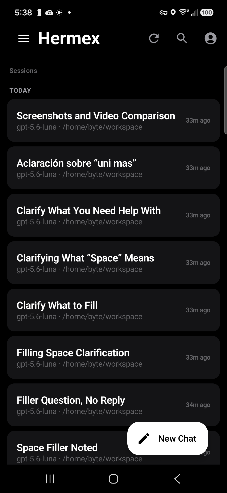 | 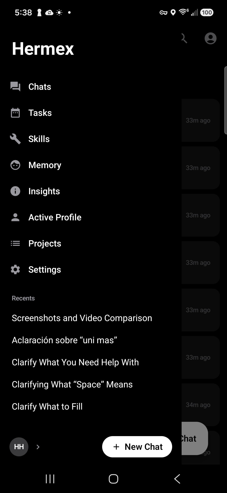 |

| Chat | Model picker |
| --- | --- |
| 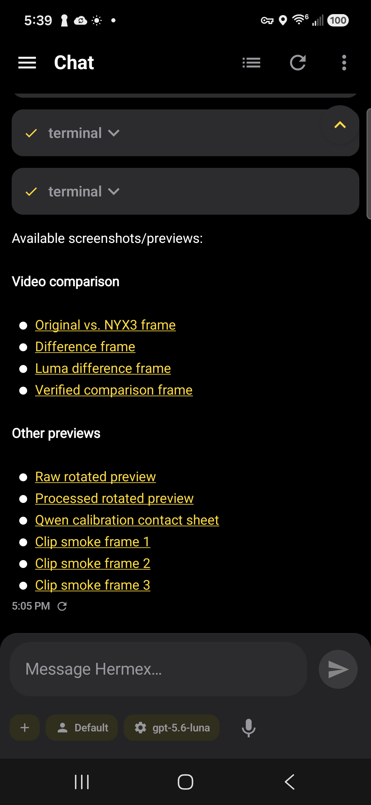 | 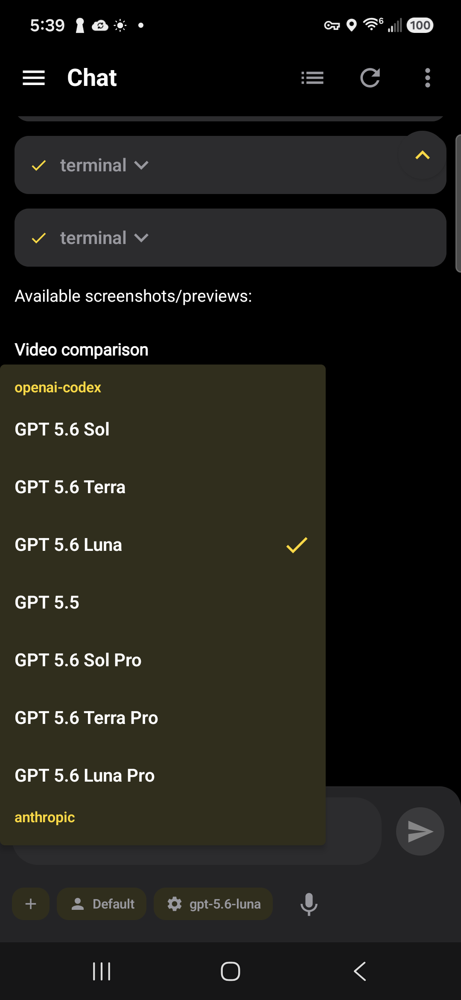 |

### Search and control-plane

| Session search | Projects |
| --- | --- |
| 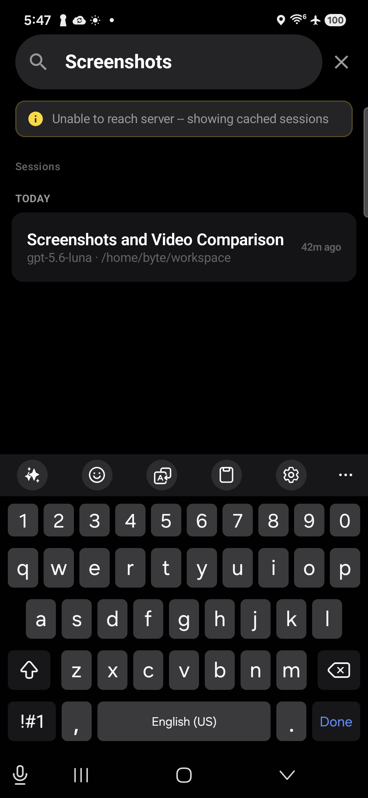 | 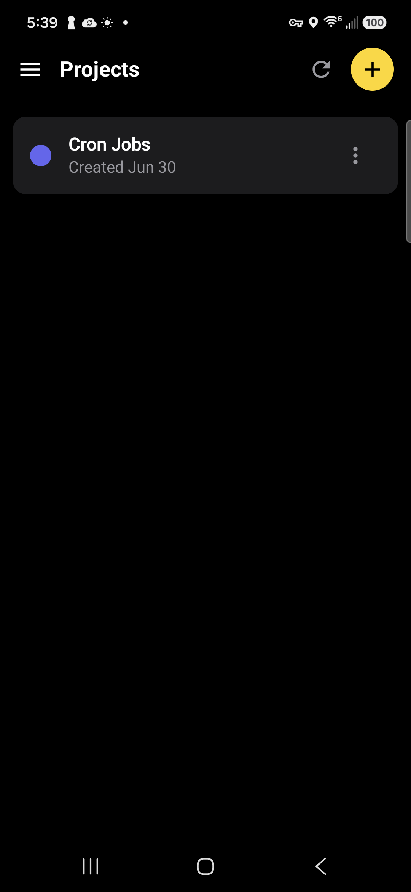 |

| Tasks | Insights |
| --- | --- |
| 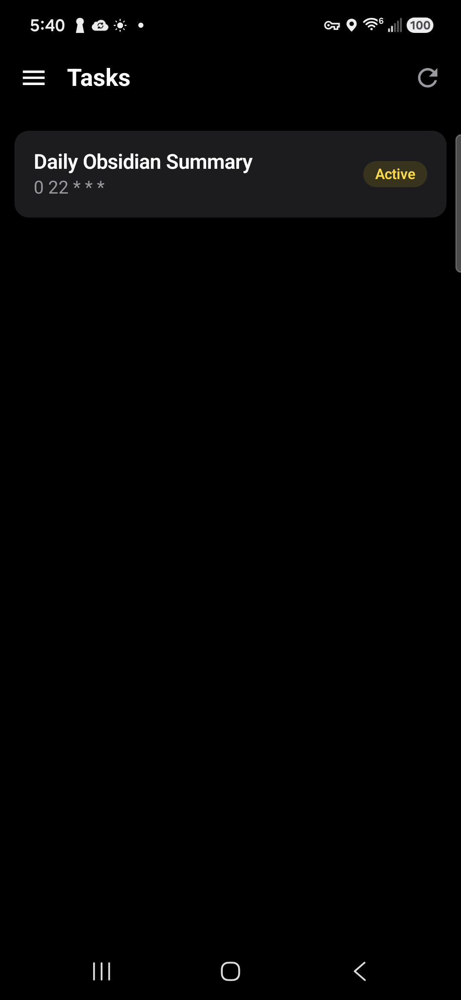 | 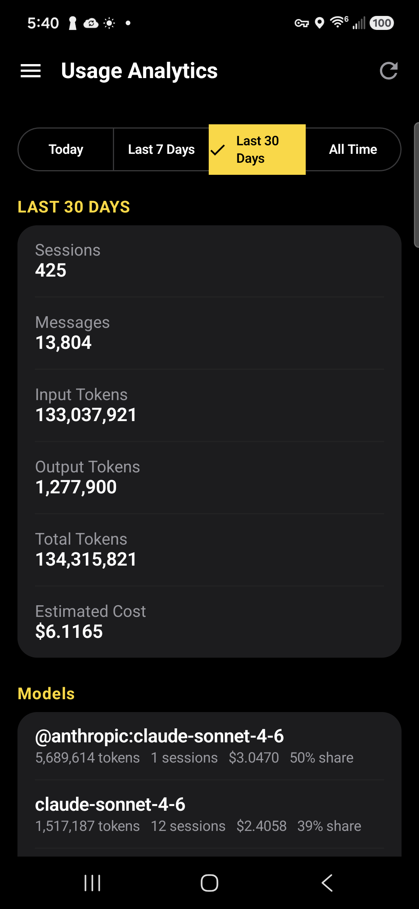 |

### Server configuration and security

| Servers | Connection headers |
| --- | --- |
| 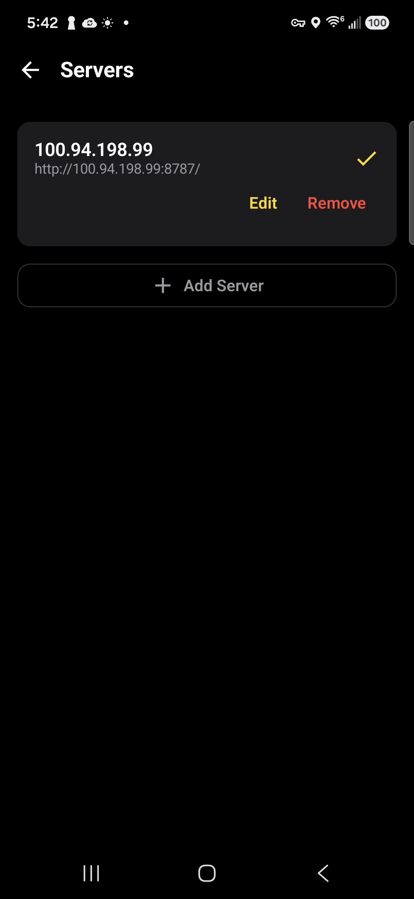 | 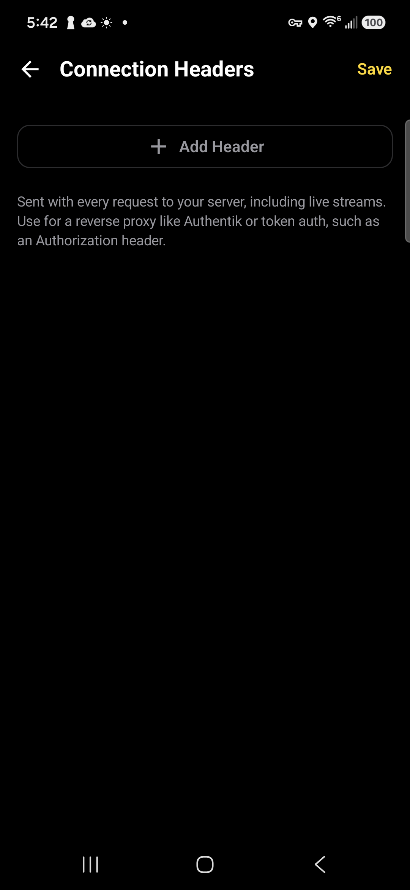 |

### Settings and appearance

| Settings | App icon picker |
| --- | --- |
| 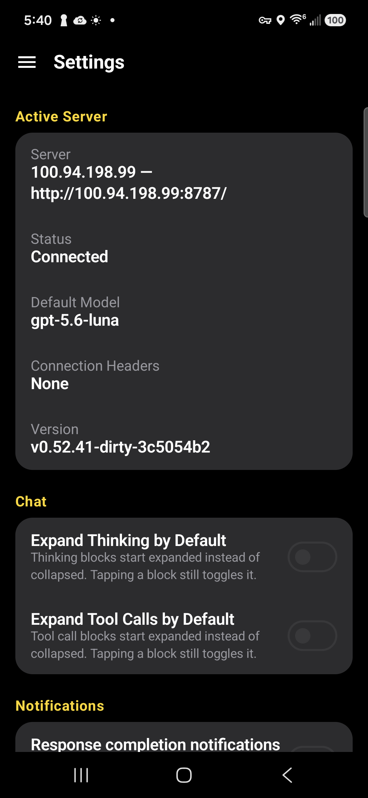 | 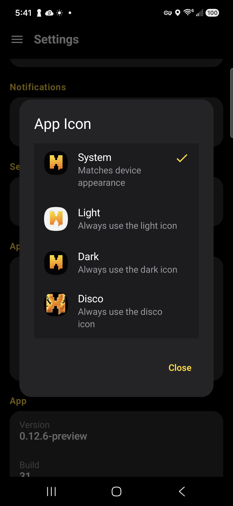 |

| Header logo color | Offline cache |
| --- | --- |
| 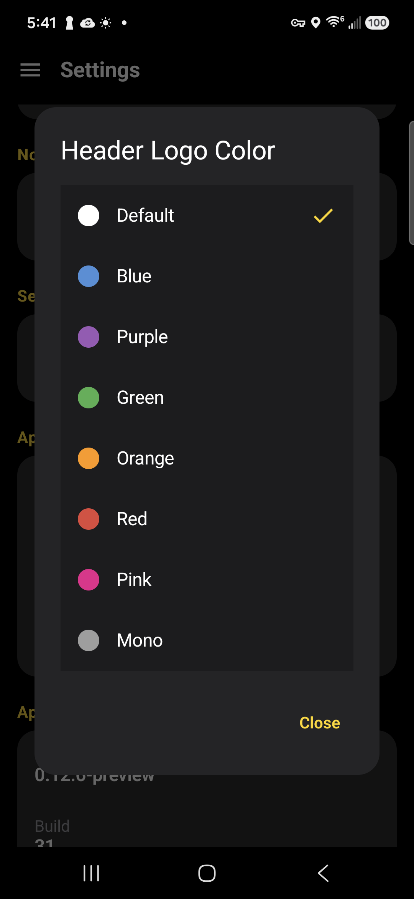 | 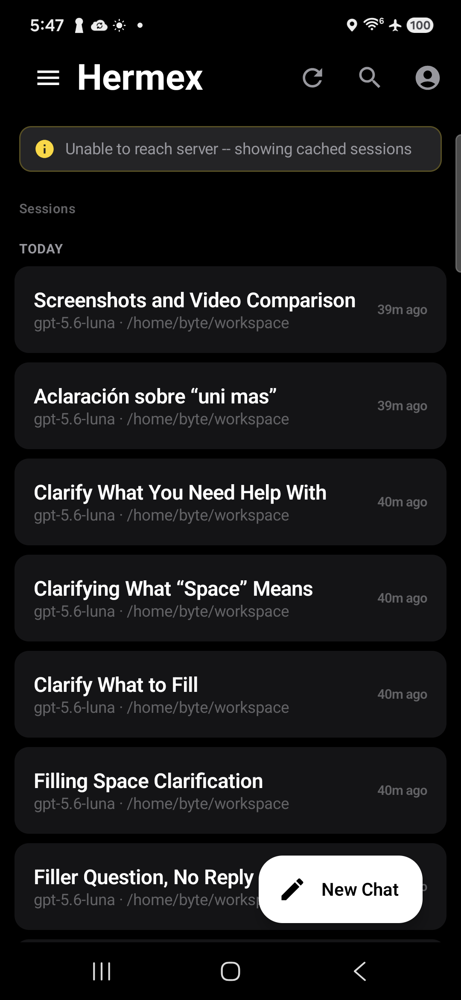 |

### Workspace

| Workspace |
| --- |
| 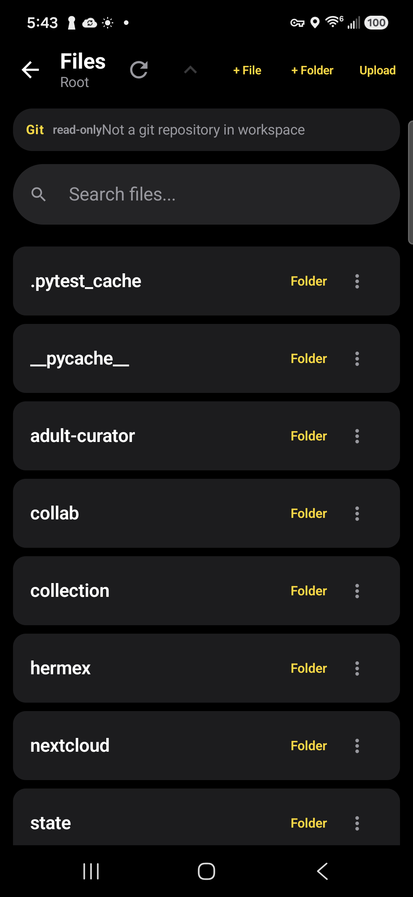 |

## Roadmap

### Completed

These reflect current, shipped capabilities:

- Authenticated multi-server access with encrypted per-server cookies
- SSE chat streaming with stop and reattach
- Attachments and inline image history
- Control-plane screens: projects, tasks, skills, memory, insights, settings
- Workspace file management with read-only Git
- Share intake, local completion notifications, widget entry point, deep links
- Room offline cache with per-server isolation and startup pruning

### In progress

There is no committed public in-progress roadmap for the current release. Work
on `master` is maintenance and fixes on top of the `0.12.6-preview` cut rather
than a publicly announced feature track.

### Planned (subject to change)

Known deferred items, not yet implemented:

- Git write actions (commit, discard, checkout, push, pull)
- Gateway-only / OpenAI-compatible server support
- Google Play Store distribution work

## Project and testing notes

- Open PRs against `master` unless a release branch is active
- Keep PRs scoped to a single feature or fix
- Include test results and, where relevant, real-device verification notes
- Run `./gradlew test` and `./gradlew assembleDebug` before proposing changes
- See `qa/1.0-regression-checklist.md`, `docs/`, and `CHANGELOG.md` for QA
  state, feature notes, and release history

## License

Hermex Android is licensed under the [MIT License](LICENSE). See
[ATTRIBUTION.md](ATTRIBUTION.md) for upstream provenance and redistribution
guidance, and [THIRD_PARTY_NOTICES.md](THIRD_PARTY_NOTICES.md) for upstream and
dependency notices.
